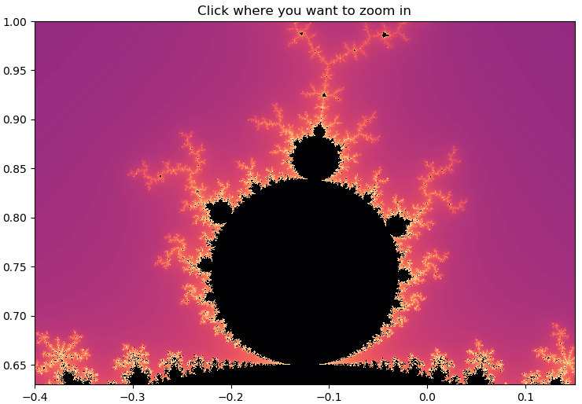
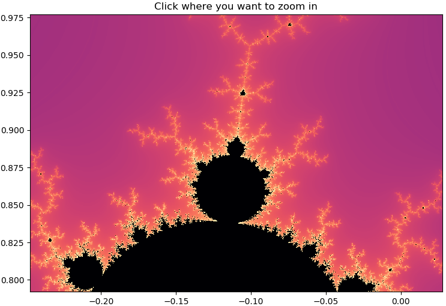

## mandelbrot

Create an interactive Mandelbrot set figure

### Dependencies
- python 3
- numpy
- matplotlib
- numba

NOTE: I have only used this with python 3.7, numpy 1.16.2, matplotlib 3.0.3 and numba 0.43.1.

### Documentation

#### Class constructor
```python
Mandelbrot.__init__(width=9, height=6, dpi=72, extent=[-2,1,-1,1], maxIter=128, cmap="cubehelix", zoom=2):
```
Parameters:
 - **width** - width of figure in inches
 - **height** - height of figure in inches
 - **dpi** - dot per inch i.e. a measurement for resolution
 - **extent** - an array of the boundary coordinates: [real_min, real_max, imaginary_min, imaginary_max]
 - **maxIter** - maximum iteration used in calculation, a larger value will render more detail
 - **cmap** - the colormap, used for customizing the color of the image, see [matplotlib.org/users/colormaps](https://matplotlib.org/users/colormaps.html) to find one that you prefer
- **zoom** - zoom parameter

#### Basic example

```python
import Mandelbrot as mb

extent = [-0.40, 0.15, 0.63, 1]
mandel = mb.Mandelbrot(extent=extent, cmap="magma")
mandel.plot()
```
This will create a matplotlib figure like this:  

  

Clicking on the small bulb on the top gives you this:  

  
