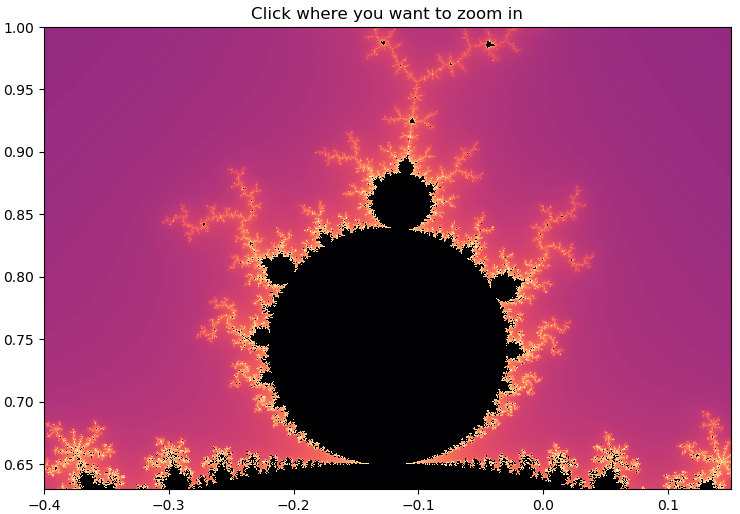
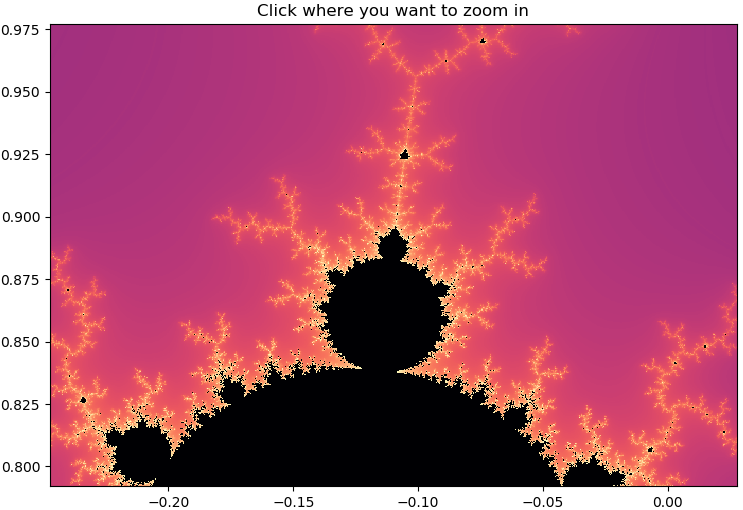

### ovn7

## A customizable Mandelbrot image generator in python

Use this library to create a Mandelbrot set.

### Installation

```python
import Mandelbrot
```

### Dependencies
- python 3.7
- numpy 1.16.2
- matplotlib 3.0.3
- numba 0.43.1

NOTE: This project has only been tested using: python 3.7, numpy 1.16.2, matplotlib 3.0.3 and numba 0.43.1

### Documentation

#### Class constructor
Create new instance of the Mandelbrot class
```python
def __init__(width=9, height=6, dpi=72, extent=[-2,1,-1,1], maxIter=128, cmap="cubehelix", zoom=2):
```
Parameters:
 - **width** - width of figure in inches
 - **height** - height of figure in inches
 - **dpi** - dot per inch i.e. a measurement for resolution
 - **extent** - an array of the boundary coordinates: [real_min, real_max, imaginary_min, imaginary_max]
 - **maxIter** - maximum iteration used in calculation, a larger value will render more detail
 - **cmap** - the colormap, used for customizing the color of the image, see [matplotlib.org/users/colormaps](https://matplotlib.org/users/colormaps.html) to find one that you prefer

#### Plot the image
Opens an interactive figure where you can zoom in
```python
def plot()
```

#### Basic example

```python
import Mandelbrot as mb # import module

extent = [-0.40, 0.15, 0.63, 1]
mandel = mb.Mandelbrot(extent=extent, cmap="magma") # create instance
mandel.plot()
```
This will create a matplotlib figure like this:  

  

Clicking on the small build on the top gives you this:  

  
